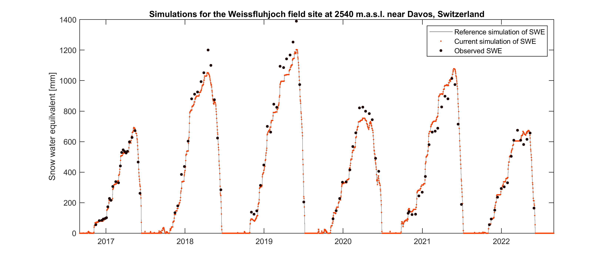

# HS2SWE

Model for converting daily snow depth recordings to daily snow water equivalents.

## Example for running the model

The following example reads snow measurements from the Weissfluhjoch field site, runs the HS2SWE model, and finally displays the results:

```matlab
% Clear workspace

close all; clear; home;

% Load data

data_wfj = readtable("data_weissfluhjoch.txt");

% Run HS2SWE

swe_sim = HS2SWE(data_wfj.hs_obs);

% Plot results

figure('Units','centimeters','Position',[4 4 28 12])
plot(data_wfj.time,data_wfj.swe_ref,'Color','#808080',DisplayName="Reference simulation of SWE")
hold on
plot(data_wfj.time,swe_sim,'.','Color','#f54209',DisplayName="Current simulation of SWE")
plot(data_wfj.time,data_wfj.swe_obs,'.','Color','#1e0000','MarkerSize',12,DisplayName="Observed SWE")
ylabel("Snow water equilvalent [mm]")
legend()
title("Simulations for the Weissfluhjoch field site at 2540 m.a.s.l. near Davos, Switzerland")
```

The example shows that for Weissfluhjoch the simulations matches the biweekly snow water equivalent observations well in most years.



## Model description

The HS2SWE method is based on the concept presented by Martinec and Rango (1991) which describes accumulation, densification and melt of the snowpack layer-by-layer. The only input to the model is the observed daily HS. The HS2SWE model has been in operational use for snow-hydrological forecasting in Switzerland for over a decade. The simulation results are used for assimilation into a temperature-index snow melt model (Magnusson et al., 2014) and for improving spatial snowfall fields (Mott et al., 2023). The original method proposed by Martinec and Rango (1991) has been used in long-term assessments of snow water resources in the Swiss Alps (Rohrer & Braun, 1994) and inspired the recently developed ∆SNOW model (Winkler et al., 2021) described below. Unlike empirical regression models relating SWE to HS (e.g., Hill et al., 2019; Jonas et al., 2009; Sturm et al., 2010), the HS2SWE model provides realistic and continuous SWE estimates. In this model, increases in SWE indicate snowfall events, while decreases signify snowmelt episodes.

HS2SWE operates by simulating the evolution of the snowpack, layer-by-layer, where each layer is defined by its density and thickness. The model forecasts compaction for each layer and adapts the snowpack layering through accumulation, densification, or melting, depending on the difference between the predicted and observed HS. We illustrate the simulation process of the HS2SWE model through a hypothetical four-day scenario encompassing all relevant model steps. On day 1, we introduce the creation of the initial snow layer. Day 2 showcases subsequent accumulation events. Day 3 demonstrates snow settling and the management of compaction and measurement uncertainties. Finally, on day 4, we depict how the model handles snowmelt. This simulation process is detailed below and visualized in Figure 3.

Day 1: An initial layer of snow forms upon the first observation of HS above zero. This layer mirrors the measured thickness and adopts the density characteristic of fresh snow, a calibrated parameter within the model. The mass of this layer is thus calculated based on its thickness and density.

Day 2: The densification of the initial snow layer formed on day one is forecasted using the Sturm and Holmgren (1998) model, augmented with an empirically derived correction term:

...EQUATION...

Here, i represents time index [-], \rho denotes the layer density [kg m-3], \sigma signifies the overburden load [Pa], \eta_0 stands for a viscosity parameter [Pa s], ∆ρ indicates the density difference between the layer and fresh snow (constrained to positive values) [kg m-3], and ∆t represents the time step [s]. Additionally, the equation includes three parameters c_1 [-], c_3 [kg-1 m3], and c_5 [kg-1 m3].
As illustrated in Figure 3, upon reaching day two, the observed HS exceeds the predicted HS, including the uncertainty of depth measurements. In this situation, an additional snow layer is introduced. Its thickness equals the difference between observed and predicted HS and adopts the density of fresh snow. For this study, we set the HS recording uncertainty at 2 cm, reflecting the measurement error in our HS observations (see section 2.2).

Day 3: On day three, the predicted HS falls slightly below the observed HS, within the range of measurement errors, and we employ an iterative approach to fine-tune snow densification for all snow layers. This iterative adjustment ensures a realistic range of predicted snow depths by utilizing Equation 2 while considering the snow settling process. The latter two terms in the equation undergo a modification by multiplying or dividing the densification rates by a correction factor. This factor, starting at 1.0, is increased in successive steps of 0.1 until either the measured HS is matched, a maximum snow density is reached, or a maximum number of 50 iterations is attained. During this iterative process on day three, the observed HS is achieved, thereby maintaining the mass of the snowpack unchanged. However, adjustments are made to the densities of all snow layers to reflect this refinement.

Day 4: On the final day, the observed HS drops below the predicted HS, even after increasing snow settling using the iterative adjustments of compaction rates as outlined in the description of day three. In such cases, the top layers of the simulated snowpack are removed until the measured HS is reached. The algorithm also allows parts of snow layers to be removed if the difference between observed and predicted HS does not align with layer boundaries. The amount of snowmelt is calculated from the thicknesses and densities of the snow layers that were removed. Thus, melt can occur due to strong declines in observed HS, or when the maximum density of all layers is reached.

...FIGURE...

Figure 3. Schematic illustrating a hypothetical four-day simulation scenario encompassing the creation of an initial snow layer (day 1), subsequent snow accumulation (day 2), snow settling including uncertainty (day 3), and melting (day 4) as simulated by the HS2SWE model.


## References

...REFERENCES...

